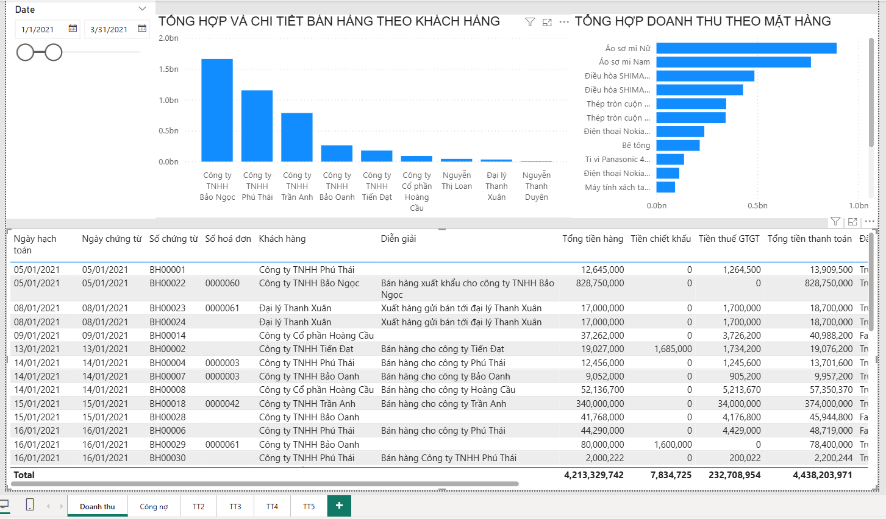
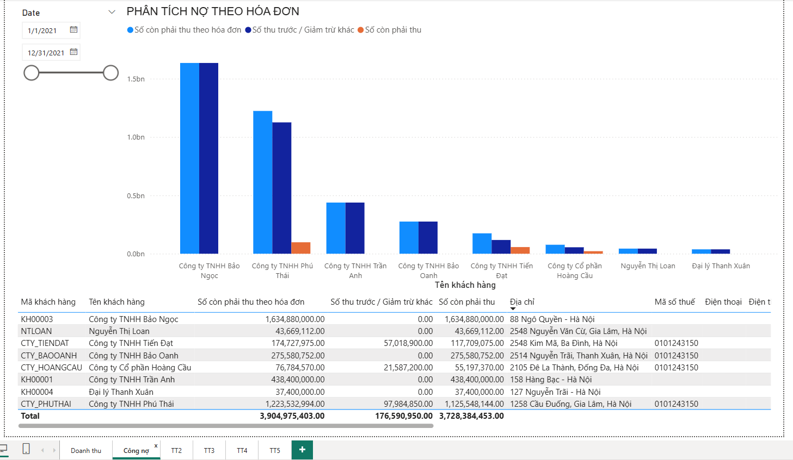
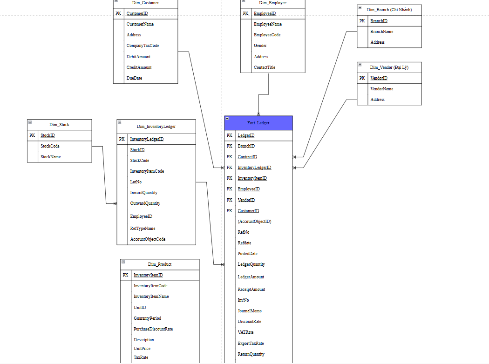

# 📊 Revenue & Receivables Dashboard from MISA TT200 Sample (SQL + SSIS + Power BI)

## 📌 Project Overview

This is a **self-built BI reporting project** based on the **TT200 sample database provided by MISA** – a leading Vietnamese accounting software vendor. The project simulates a real-world financial reporting pipeline using SQL Server tools for data extraction and transformation, and **Power BI for visualization**.

The full workflow includes:
- Data extraction and transformation using **T-SQL (SSMS) + SSIS**
- Building **fact & dimension tables** (star schema model)
- Creating **Data Marts** for Revenue and Receivables analysis
- Designing an interactive dashboard in **Power BI**

> 📌 This project is self-developed based on publicly available MISA study data for learning and demonstration purposes.

---

## 🧰 Tech Stack

| Component     | Tool/Technology           |
|---------------|---------------------------|
| Data Source   | MISA TT200 SQL Server Sample DB |
| ETL           | SSMS (T-SQL), SSIS        |
| Data Modeling | Fact-Ledger, Dim-Customer, Data Marts |
| Reporting     | Power BI Desktop          |
| Language      | SQL (T-SQL), DAX          |

---

## 🛠️ ETL & Data Modeling

### ✅ 1. Fact Table: `Fact_Ledger`

- Unified from both **SaleLedger** and **PurchaseLedger** using `UNION ALL`
- Common fields include: `InventoryItemID`, `CustomerID`, `VendorID`, `LedgerAmount`, `LedgerQuantity`, `UnitPrice`, `VATAmount`, `RefDate`, etc.
- Added column `LedgerType`: `0 = Sale`, `1 = Purchase`

### ✅ 2. Dimension Table: `Dim_Customer`

- Enriched from `AccountObject`, includes:
  - `CustomerID`, `CustomerName`, `Address`, `TaxCode`, `DueTime`, `DebitAmount`, `CreditAmount`

### ✅ 3. Data Mart: `Debt_Receip_Cus`

- Joined from view `View_DIAccountObject` and `Kien_NoPaymentDebt`
- Aggregated fields:
  - `InvReceiptableDebtAmount`, `AdvanceDeductionAmount`, `ReceiptableDebtAmount`

### ✅ 4. Data Mart: `Debt_Customer`

- Calculates:
  - `InvoiceAmount`, `RemainDebtDay`, `DebtPeriodType`
- Filters only `Accounts Receivable` where `(Debit - Credit) > 0`

### ✅ 5. Data Mart: `Item_Acc_Revenue`

- Revenue fact by product and customer:
  - `InventoryItemName`, `total_revenue`, `total_sales`, `RefDate`, `VATAmount`, etc.

---

## 📊 Power BI Dashboard Highlights

The Power BI dashboard includes multiple layers of insights:

### 📈 Key Reports:
- Total Revenue by Month
- Receivable Aging by Customer
- Top Customers by Invoice Amount
- Revenue Breakdown by Product / Item
- Overdue Debts & Due Date Analysis

### 🔍 Slicers/Filters:
- Date range, Account object, Branch, Inventory Item

🖼️ *Dashboard preview available in `.pbix` file*
### 🔍 Dashboard Previews

**Revenue Overview Report**

> Tracks monthly revenue trends, top-selling products, and revenue by account or customer.
>
> **Receivables Analysis Report**

> Displays outstanding invoices, aging buckets, and high-risk overdue debts.
---

## 🧩 Data Model (ERD)

The data warehouse model follows a **star schema** with `Fact_Ledger` at the center joined to dimension and data marts:

  
*(Diagram designed using draw.io and exported as PNG)*

---

## 📁 File Structure
/BAOCAOMISA/
│

├── BAOCAOMISA.pbix # Power BI report

├── assets/

│ └── data_model.png # ERD / Schema diagram

├── etl/

│ └── Fact_Ledger.sql # SQL script for fact

│ └── Datamart_Debt_Revenue.sql

└── README.md

## 👤 Author

**Ha Thuy Nguyen**  
